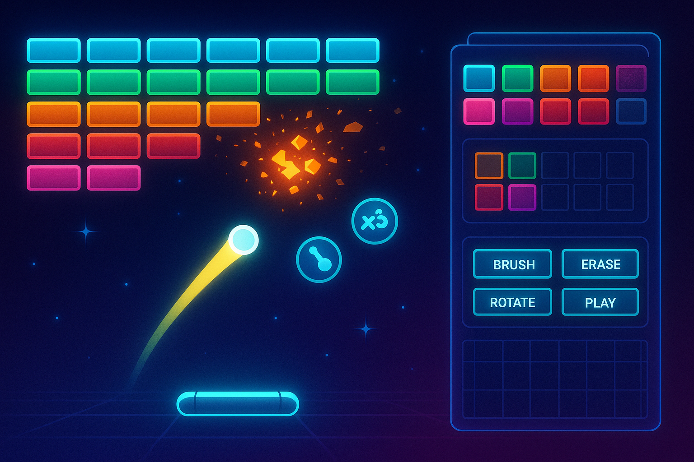
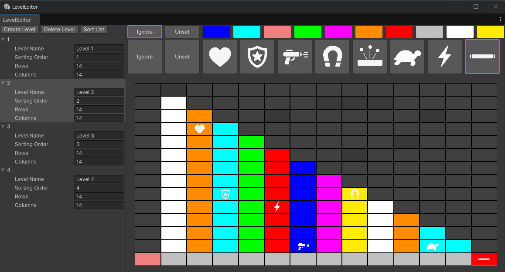

# BrickBreaker

A modern Arkanoid-clone game developed with Unity 6, featuring a powerful level editor built with UI Toolkit.

## Overview

BrickBreaker is a reimagining of the classic brick-breaking gameplay that defined Arkanoid and similar titles. This project serves as both a nostalgic gaming experience and a showcase for Unity 6's UI Toolkit capabilities.

The project is structured around two main components:
1. A comprehensive level editor built entirely with UI Toolkit
2. The classic brick-breaking gameplay with modern enhancements

## Level Editor

The heart of this project is the sophisticated level editor designed to provide complete creative control. Built using Unity's UI Toolkit, the editor offers:

### Features

- **Level Creation**: Visually design levels with an intuitive drag-and-drop interface
- **Brick Customization**: 
  - Configure brick types, colors, and behaviors
  - Set hit points and destruction effects
  - Designate power-up drops for specific bricks
- **Enemy Configuration**: Script the appearance of enemy minions based on time or game events
- **Level Organization**: 
  - Create, save, edit, and delete levels
  - Organize levels into sequences with customizable progression
- **Asset Management**: Browse and manage all existing levels through a clean interface

### Technical Implementation

The level editor utilizes Unity's UI Toolkit to create a responsive and modern user interface. Levels are saved as Scriptable Objects, making them easy to manage and integrate into the game.

## Game Mechanics

BrickBreaker features classic Arkanoid-style gameplay with several modern enhancements:

- **Paddle Control**: Precise paddle movement with optional special abilities
- **Ball Physics**: Realistic ball behavior with configurable properties
- **Power-ups**: Multiple power-up types that affect gameplay:
  - Paddle size modifications
  - Multi-ball
  - Ball speed changes
  - Special weapons
  - Extra lives
- **Enemy Minions**: Challenging obstacles that appear during gameplay
- **Progression System**: Level-to-level advancement with increasing difficulty

## Installation

1. Clone this repository
2. Open the project in Unity 6.0.0 or newer
3. Ensure Universal Render Pipeline (URP) package is installed
4. Open the main scene to start exploring

## Usage

### Level Editor

1. Navigate to the Level Editor scene
2. Create a new level or select an existing one to edit
3. Use the toolbar to place and configure bricks
4. Test your level directly from the editor
5. Save and organize your levels into sequences

### Playing the Game

1. Launch the game from the main menu
2. Select a level sequence
3. Begin with level 1 and progress through the sequence
4. Unlock achievements and compete for high scores

## Development Roadmap

- [x] Project setup and basic architecture
- [x] Level editor UI implementation
- [x] Brick customization system
- [x] Level saving and loading
- [x] Level sequence management
- [ ] Core gameplay mechanics
- [ ] Power-up system
- [ ] Enemy AI
- [ ] Visual effects and polish
- [ ] Sound design
- [ ] Main menu and UI
- [ ] High score system

## Technical Details

- **Engine**: Unity 6.0
- **Rendering**: Universal Render Pipeline (URP)
- **UI**: UI Toolkit
- **Scripting**: C#
- **Level Storage**: Scriptable Objects

## Update 2025-05-18
This is how the Level editor looks after the first iteration.

## Contributing

Contributions to BrickBreaker are welcome! Whether it's bug fixes, new features, or level designs, please feel free to submit pull requests.

## License

This project is licensed under the terms included in the LICENSE file.

---

*BrickBreaker is a learning project focused on demonstrating UI Toolkit capabilities in Unity 6.*
